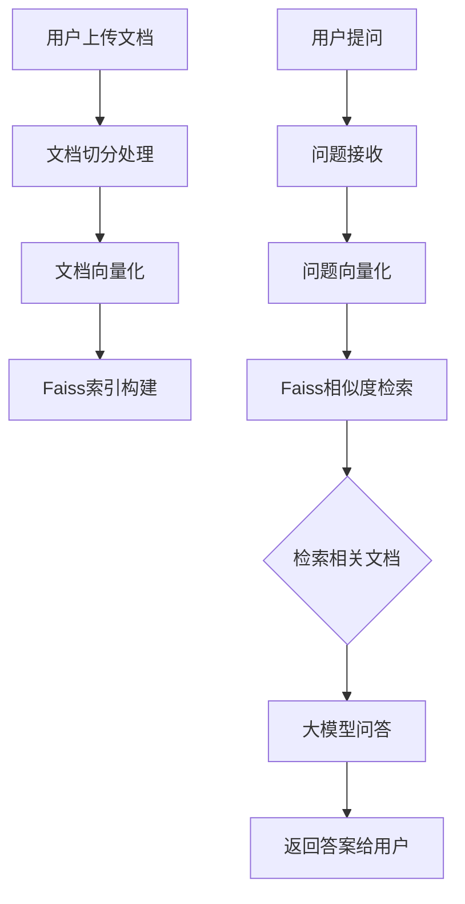

# 基于RAG的问答系统：BGE与ChatGLM3模型微调及部署

本项目是一个完整的基于检索增强生成（Retrieval-Augmented Generation, RAG）技术的问答系统，包含文档处理、向量检索和大语言模型问答三个核心模块。项目通过微调BGE文本表征模型和ChatGLM3大语言模型，构建了一个高效的问答系统，并通过Streamlit构建了友好的Web界面。

## 项目结构

```
p-llm-rag-bge-chatglm3-model-finetune/
├── bge-finetune/           # BGE文本表征模型微调模块
│   ├── data/               # 训练数据及处理脚本
│   ├── finetune/           # 模型微调相关代码
│   └── predict/            # 模型推理相关代码
├── chatglm3-finetune/      # ChatGLM3大语言模型微调模块
│   ├── data/               # 训练数据及处理脚本
│   ├── finetune/           # 模型微调相关代码
│   └── predict/            # 模型推理相关代码
└── service/                # Web服务模块
    ├── faiss_module/       # Faiss向量检索模块
    └── web_service/        # Streamlit Web服务
```

## 技术架构



## 核心模块介绍

### 1. BGE文本表征模型微调模块

BGE（Bidirectional Guided Encoder）模型用于文本表征任务，通过微调提升在中文文本检索任务中的表现。

#### 功能特点
- 利用BGE-base-zh模型进行长文本表征任务微调
- 采用对比学习方法进行数据构造和训练
- 支持跨设备负样本共享，增强训练效果

#### 数据处理
数据来源于开源社区huggingface.co中的Multi-Doc-QA-Chinese数据集，参考文档源数据来自悟道开源200GB数据，其中问题和回答是通过大语言模型（GPT-3.5）自动生成的，并且具有高质量。

数据处理流程：
1. 从原始数据中提取问题(query)、正样本(pos)和负样本(neg)
2. 将数据按比例分割为训练集(99%)和验证集(1%)
3. 保存为[train.jsonl](bge-finetune/data/train.jsonl)和[dev.jsonl](bge-finetune/data/dev.jsonl)文件

#### 模型训练
采用双塔模型结构进行训练，使用以下命令进行模型微调：

```bash
cd bge-finetune/finetune

python3 run.py --model_name_or_path "BAAI/bge-base-zh" \
               --train_data "../data/train.jsonl" \
               --output_dir ./save_files \
               --num_train_epochs 3 \
               --per_device_train_batch_size 4 \
               --learning_rate 1e-5 \
               --save_steps 1000 \
               --logging_steps 100 \
               --query_max_len 32 \
               --passage_max_len 128
```

或者使用简化脚本：

```bash
python3 bge_finetune.py --do_train \
                        --model_name "BAAI/bge-base-zh" \
                        --train_file "data/train.jsonl" \
                        --valid_file "data/dev.jsonl" \
                        --output_dir ./outputs/bge-model \
                        --num_epochs 3 \
                        --batch_size 4
```

#### 模型推理
训练完成后，可以使用以下命令进行文本表征和相似度计算：

```bash
cd bge-finetune/predict

python3 get_embedding.py --model_name_or_path "your_model_path"
```

或者：

```bash
python3 bge_finetune.py --do_predict \
                        --output_dir "./finetune/save_files" \
                        --test_file "data/dev.jsonl"
```

### 2. ChatGLM3大语言模型微调模块

ChatGLM3是智谱AI开发的大语言模型，本项目基于ChatGLM3-6B模型进行知识库问答任务的微调。

#### 功能特点
- 使用QLoRA技术进行高效微调，显著降低显存占用
- 支持4bit量化和LoRA适配器结合，进一步减少资源消耗
- 针对RAG问答任务的数据处理和指令微调格式

#### 数据处理
同样使用Multi-Doc-QA-Chinese数据集，处理流程包括：
1. 从原始数据集中提取问题、答案和相关文档
2. 构造指令微调格式(instruction tuning format)的数据
3. 按比例分割为训练集(99%)和验证集(1%)

#### 模型训练
使用QLoRA技术进行训练，通过以下命令启动训练：

```bash
cd chatglm3-finetune/finetune

python3 train_qlora.py --train_args_json ./chatglm3-6b_QLoRA.json  \
                            --train_data_path ../data/train.jsonl  \
                            --eval_data_path ../data/dev.jsonl  \
                            --model_name_or_path chatglm3-6b/  \
                            --seed 42  \
                            --max_input_length 1024  \
                            --max_output_length 512  \
                            --lora_rank 4  \
                            --lora_dim 8
```

#### 模型合并与量化
训练完成后，可以合并LoRA权重与基础模型并进行量化：

```bash
python3 merge_lora_and_quantize.py --lora_path "your_lora_path" \
                                   --output_path "merged_model_path" \
                                   --qbits 4
```

#### 模型推理
使用以下命令进行模型推理：

```bash
cd chatglm3-finetune/predict

python3 predict.py --model_path "your_model_path"
```

### 3. Web服务模块

Web服务模块基于Streamlit构建，整合了文档处理、向量检索和大语言模型问答功能。

#### 功能特点
- 支持PDF和DOCX格式文档上传
- 自动切分文档并构建向量索引
- 利用Faiss进行高效向量检索
- 集成微调后的ChatGLM3模型进行问答

#### 核心组件
- [faiss_module](service/faiss_module)：Faiss向量检索模块
  - [get_embedding.py](service/faiss_module/get_embedding.py)：文档向量化和Faiss索引构建
- [web_service](service/web_service)：Streamlit综合服务
  - [web.py](service/web_service/web.py)：Streamlit问答主函数
  - [split.py](service/web_service/split.py)：用于针对输入文档进行拆分的方法
  - [model.py](service/web_service/model.py)：大语言模型调用接口
  - [flag_models.py](service/web_service/flag_models.py)：文本向量化模型实现
  - [configs.py](service/web_service/configs.py)：配置文件

#### 文档处理流程
文档处理首先通过[split.py](service/web_service/split.py)对用户上传的文档进行切分：

```python
def split_content_to_parse(content, max_length):
    """
    将内容按句子分割并重新组合成段落
    """
    sentences = re.split(r"([。！？；.!?;])", content)
    sentences.append("")
    sentences = ["".join(i) for i in zip(sentences[0::2], sentences[1::2])]
    if sentences[-1] == "":
        sentences.pop(-1)
    # ... 处理逻辑
```

#### 向量检索模块
使用[get_embedding.py](service/faiss_module/get_embedding.py)构建文档向量索引和检索相关文档：

```python
class Service:
    def __init__(self, model_path, doc_path):
        self.model = FlagModel(model_path,
                               query_instruction_for_retrieval="为这个句子生成表示以用于检索相关文章：",
                               use_fp16=True)
        # ...
```

#### 服务运行
使用以下命令启动Web服务：

```bash
cd service/web_service

streamlit run web.py -- --server.port 1111 \
                      -- --embed_model_path 'your embedding model path' \
                      -- --model_path 'your llm model path'
```

运行流程说明：
1. 初始化ChatGLM大语言模型和BGE向量模型
2. 启动Streamlit Web服务
3. 用户上传文档文件（PDF或DOCX格式）
4. 系统自动切分文档并构建向量索引
5. 用户输入问题，系统检索相关文档片段
6. 将问题和相关文档发送给大语言模型生成答案

## 总结

本项目基于RAG（Retrieval-Augmented Generation）技术构建了一个完整的问答系统，包含以下特点：

1. 完整的端到端解决方案：从模型微调到Web服务部署
2. 高效的模型训练：采用QLoRA和对比学习技术降低资源消耗
3. 友好的用户界面：基于Streamlit构建Web界面，便于使用
4. 灵活的模块化设计：各模块相对独立，便于单独维护和扩展
5. 优秀的问答体验：结合向量检索和大语言模型，提供准确的回答

通过本项目，可以快速搭建一个基于自有知识库的问答系统，适用于企业知识管理、智能客服、教育辅助等多种场景。