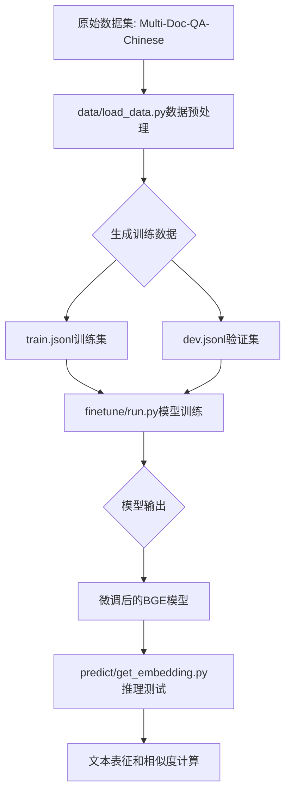

## 项目简介

本项目是基于BGE模型的文本表征模型。利用bge-base-zh模型从开源数据中进行长文本表征任务微调，并利用对比学习方法进行数据构造。

项目主要结构如下：
- data：存放数据及数据处理的文件夹。
  - dev.jsonl：验证集数据。
  - train.jsonl：训练数据。
  - load_data.py：用于针对开源数据进行数据处理，生成训练集及验证集数据。
- finetune：模型训练的文件夹。
  - arguments.py：BGE训练中相关的配置信息。
  - data.py：BGE训练时所需要构建的数据格式。
  - modeling.py：BGE模型文件。
  - run.py：BGE训练主函数。
  - trainer.py：BGE训练的trainer方法。
- predict：推理所需的代码文件夹。
  - get_embedding.py：利用已训练的模型进行文本表征并计算相似度

## 整体流程



## 数据处理

load_data.py文件，会在data文件夹中生成训练集和测试集文件。

命令如下：

```shell
cd data

python3 load_data.py --data_path "your_data_path" --save_home "./"
```

本项目中的数据来源于开源社区huggingface.co中的Multi-Doc-QA-Chinese，参考文档源数据来自悟道开源200GB数据，其中问题和回答是通过大语言模型（GPT-3.5）自动生成的，并且具有高质量。原始数据集中，每个样本包含一个参考文档、99个无关文档、一个问题和一个基于参考文档的回答。

数据地址为：https://huggingface.co/datasets/yuyijiong/Multi-Doc-QA-Chinese

注意：如果需要修改数据生成路径或名称，load_data.py中相关配置的路径。

数据处理流程：
1. 从原始数据中提取问题(query)、正样本(pos)和负样本(neg)
2. 将数据按比例分割为训练集(99%)和验证集(1%) 
3. 保存为[train.jsonl](bge-finetune/data/train.jsonl)和[dev.jsonl](bge-finetune/data/dev.jsonl)文件

数据处理关键代码片段：

```python
def get_data(home, save_home):
    """
    处理原始数据，生成训练和验证集
    """
    data = []
    for name in os.listdir(home):
        if not name.endswith('json'):
            continue
        path2 = os.path.join(home, name)
        print(path2)
        with open(path2, 'r', encoding="utf-8") as f:
            for line in f:
                sample = json.loads(line)
                query = sample['QA'][0]['question']
                pos = [sample['positive_doc'][0]['text']]
                negative_doc = sample['negative_doc']
                neg = [negative_doc[idx]['text'] for idx in random.choices(range(len(negative_doc)), k=10)]
                # 构造训练数据格式
                data.append(json.dumps({"query": query, "pos": pos, "neg": neg}, ensure_ascii=False))

    # 按比例分割训练集和验证集
    size = int(len(data) * 0.01)
    train = data[size:]
    dev = data[:size]
    
    # 保存数据
    with open(os.path.join(save_home, 'train.jsonl'), 'w', encoding="utf-8") as f:
        f.writelines('\n'.join(train))
    with open(os.path.join(save_home, 'dev.jsonl'), 'w', encoding="utf-8") as f:
        f.writelines('\n'.join(dev))
```

生成的数据格式如下：
```json
{
  "query": "孩子为什么容易在手术前感到紧张或焦虑？",
  "pos": ["即使是小手术,也会让人紧张不已。孩子们很容易在手术前感到紧张或焦虑,因为他们不太容易理解复杂的医学术语。此外,医生也不愿意向16岁以下的儿童开抗焦虑药物。"],
  "neg": ["一到周末就睡到中午?专家提醒赖床补觉只会适得其反\n\n经过了一个星期的工作和学习,你是不是一到周末就想睡到自然醒？", "..."]
},{
    "id": 58087,
    "dataType": "健康",
    "title": "乳腺肿瘤患者更应科学防护、科学就诊-抗癌管家",
    "content": "经过艰苦的战斗,疫情狙击战来到关键时刻。疫情之下,很多肿瘤患者回院复诊的需求无法满足。而肿瘤患者由于其体质特殊,需要更多的关注与支持。在当前复杂的形势下,肿瘤患者如何做好自我防护,又如何进行合理就诊？【肿瘤资讯】特邀中国医药教育协会乳腺癌个案管理师分会主任委员黄利虹护士长为我们介绍疫情之下,肿瘤患者如何做好自我防护,安全就诊。 黄利虹 护士长 中国医药教育协会乳腺癌个案管理师分会主任委员中国医药教育协会乳腺疾病专业委员会常务委员北京乳腺学会护理专业委员会委员 疫情之下,线上平台给肿瘤患者带来专业的实时建议 音频1.mp3来自肿瘤资讯00:0001:21 黄利虹护士长:非常感谢社会在疫情之下关注肿瘤患者这一特殊群体。今年的春节让我们每个人刻骨铭心 ,新型冠状病毒疫情受到大家的广泛关注。而对于正在接受治疗的肿瘤患者而言, 抗癌管家,我们一起抗癌,治愈癌症不是梦。她们处于居家休养与医院治疗的交替过程,当前的疫情令她们更为不安和忧虑,她们担心去医院治疗的风险及延迟治疗的风险,加之疾病本身的原因,自身免疫力也有可能下降,那么她们更需要专业人士的专业指导。虽然所有线下会议、健康宣教等形式都会暂停,但这并不意味着对患者的教育与关注会暂停。各大肿瘤中心都会选择线上教育,各种科室、医院及大众的交流平台,能够随时与患者进行互动,动态解决患者亟待解决的问题。 疫情之下,肿瘤患者自我防护、科学就诊 音频2.mp3来自肿瘤资讯00:0005:20 黄利虹护士长:首先,疫情之下请肿瘤患者一定要进行科学防护,不信谣、不传谣。2003年,很多人经历过sars,而本次新型冠状病毒肺炎尽管大面积爆发,但依然无需恐慌。我们所有人都需要遵循专家建议,进行科学防护,居家隔离,减少探亲访友,减少接触。同时要注意生存环境卫生。无论是饮食卫生、还是居家环境卫生,都需要注意。勤洗手,尤其需要按照正确的洗手方法洗手。若有亲友来访,无法回避,一定要注意环境卫生。定期开窗通风,维持室内温度适宜。肿瘤患者需要注意什么呢？以乳腺癌患者为例,由于治疗是长期的,包括外科手术治疗、化疗、内分泌治疗、靶向治疗等治疗,一定需要常备部分药品。由于肿瘤患者免疫力较差,一定要注意自我防护。 其次,肿瘤患者一定要注意健康饮食,保证营养。饮食中需要补充优质的蛋白质,有充足的牛奶、鸡蛋等优质蛋白质的摄入。尤其鸡蛋一定要煮熟。在化疗期间,患者出现呕吐、食欲不振等情况,可以适当补充蛋白粉等日常所需蛋白质。常用增强抵抗力的食物如鱼肉、海鲜、豆制品等。另外还需要注意多吃水果蔬菜,并保证水的摄入。 第三,对于处于化疗期,必须要在医院就诊、住院的患者,最好有固定的家属陪同,在住院期间一定要全程佩戴口罩,口罩的选择宜选择医用外科口罩或n95口罩,并科学佩戴。在住院过程中,无论是患者还是陪伴家属,均不要窜病房,避免交叉感染。饭前饭后一定都要注意手消毒,包括对餐具的消毒。因此不仅仅是患者需要遵守相关医院管理规定,陪伴的家属同样需要遵守相关规定。 第四,患者在不同的治疗阶段,会有不同的治疗需求。例如化疗的患者则必须住院,靶向治疗的患者需要在医院输液,这都是必须在医院就诊的。也有部分患者需要进行随访观察。若内分泌治疗患者需要配置口服药,可以由患者家属代替到医院配药。正在进行卵巢功能抑制的乳腺癌患者,戈舍瑞林等卵巢功能抑制药物可以适当延长,但需要结合联合内分泌治疗药物是他莫昔芬还是芳香化酶抑制剂,建议患者通过互联网、微信、电话等途径咨询医生。当然,如果患者确实病情变化,需要医院就诊,建议患者在做好防护的前提下尽可能到医院就诊,听从医嘱,避免耽误病情。 疫情之下,肿瘤患者发热不能大意 音频3来自肿瘤资讯00:0001:27 黄利虹护士长:肿瘤患者在化疗期间会出现骨髓抑制现象,可能会伴有发热症状。在当前的形式下,无论是在家还是在医院,都需要进行新型冠状病毒肺炎的排查,以排除感染。 抗癌管家,我们一起抗癌,治愈癌症不是梦。肿瘤患者还有可能出现白细胞显著下降等情况,一定要及时就诊,以明确诊断并进行必要的治疗。 在疫情没有发生的情况下,如果处于放化疗阶段的肿瘤患者出现发热,我们一定建议患者到医院复诊。但是在疫情之下,如果肿瘤患者出现发热,必须到医院就诊,建议患者尽可能就近就诊,避免路程中的暴露。排除新型冠状病毒感染所导致的发热后,就可以进行常规的对症处理和对症治疗。",
    "QA": null
  }
```

## 模型微调

模型训练需要运行run.py文件，会自动生成output_dir文件夹，存放每个save_model_step保存的模型文件。

本项目中采用BGE模型进行微调，模型为huggiFace中的 BAAI/bge-base-zh，路径为：https://huggingface.co/BAAI/bge-base-zh

命令如下：
- 模型训练训练
```shell
cd finetune

python3 run.py --model_name_or_path "BAAI/bge-base-zh" \
               --train_data "../data/train.jsonl" \
               --output_dir ./save_files \
               --num_train_epochs 3 \
               --per_device_train_batch_size 4 \
               --learning_rate 1e-5 \
               --save_steps 1000 \
               --logging_steps 100 \
               --query_max_len 32 \
               --passage_max_len 128
```

训练流程说明：
1. 加载预训练的BGE模型和分词器
2. 构建训练数据集，使用[TrainDatasetForEmbedding](bge-finetune/finetune/data.py#L41-L121)类处理训练数据
3. 使用[BiEncoderModel](bge-finetune/finetune/modeling.py#L9-L153)双塔模型结构进行训练
4. 使用[BiTrainer](bge-finetune/finetune/trainer.py#L13-L138)进行模型训练和优化
5. 保存训练好的模型和分词器

也可以使用[bge_finetune.py](bge-finetune/bge_finetune.py)进行训练：
```shell
python3 bge_finetune.py --do_train \
                        --model_name "BAAI/bge-base-zh" \
                        --train_file "data/train.jsonl" \
                        --valid_file "data/dev.jsonl" \
                        --output_dir ./outputs/bge-model \
                        --num_epochs 3 \
                        --batch_size 4
```

### 训练参数配置

训练参数通过[arguments.py](bge-finetune/finetune/arguments.py)定义，主要包含三类参数：

1. 模型参数(ModelArguments)：
```python
@dataclass
class ModelArguments:
    model_name_or_path: str = field(
        metadata={"help": "Path to pretrained model or model identifier from huggingface.co/models"}
    )
    config_name: Optional[str] = field(
        default=None, metadata={"help": "Pretrained config name or path if not the same as model_name"}
    )
    tokenizer_name: Optional[str] = field(
        default=None, metadata={"help": "Pretrained tokenizer name or path if not the same as model_name"}
    )
```

2. 数据参数(DataArguments)：
```python
@dataclass
class DataArguments:
    train_data: str = field(
        default=None, metadata={"help": "Path to train data"}
    )
    train_group_size: int = field(default=8)
    query_max_len: int = field(
        default=32,
        metadata={
            "help": "The maximum total input sequence length after tokenization for passage. Sequences longer "
                    "than this will be truncated, sequences shorter will be padded."
        },
    )
    passage_max_len: int = field(
        default=128,
        metadata={
            "help": "The maximum total input sequence length after tokenization for passage. Sequences longer "
                    "than this will be truncated, sequences shorter will be padded."
        },
    )
```

3. 训练参数(RetrieverTrainingArguments)：
```python
@dataclass
class RetrieverTrainingArguments(TrainingArguments):
    negatives_cross_device: bool = field(default=False, metadata={"help": "share negatives across devices"})
    temperature: Optional[float] = field(default=0.02)
    fix_position_embedding: bool = field(default=False, metadata={"help": "Freeze the parameters of position embeddings"})
    sentence_pooling_method: str = field(default='cls', metadata={"help": "the pooling method, should be cls or mean"})
    normlized: bool = field(default=True)
    use_inbatch_neg: bool = field(default=True, metadata={"help": "Freeze the parameters of position embeddings"})
```

### 数据处理逻辑

训练数据通过[TrainDatasetForEmbedding](bge-finetune/finetune/data.py#L41-L121)类进行处理：

```python
class TrainDatasetForEmbedding(Dataset):
    def __getitem__(self, item) -> Tuple[str, List[str]]:
        query = self.dataset[item]['query']
        if self.args.query_instruction_for_retrieval is not None:
            query = self.args.query_instruction_for_retrieval + query

        passages = []
        pos = random.choice(self.dataset[item]['pos'])
        passages.append(pos)

        if len(self.dataset[item]['neg']) < self.args.train_group_size - 1:
            num = math.ceil((self.args.train_group_size - 1) / len(self.dataset[item]['neg']))
            negs = random.sample(self.dataset[item]['neg'] * num, self.args.train_group_size - 1)
        else:
            negs = random.sample(self.dataset[item]['neg'], self.args.train_group_size - 1)
        passages.extend(negs)

        if self.args.passage_instruction_for_retrieval is not None:
            passages = [self.args.passage_instruction_for_retrieval+p for p in passages]
        return query, passages
```

## BGE模型架构详解

### BGE模型概述

BGE (BAAI General Embedding) 是由北京智源人工智能研究院(BAAI)开发的一系列通用文本表征模型。bge-base-zh是专门针对中文文本优化的基础版本，具有强大的中文语义理解和文本表征能力。

### 核心架构特点

#### 1. 基础架构：BERT-like Transformer
- **模型类型**：基于Transformer的编码器架构
- **参数量**：约102M参数(base版本)
- **隐藏层维度**：768维
- **Transformer层数**：12层
- **注意力头数**：12个头
- **最大序列长度**：512个token

#### 2. 输入处理机制
- **分词器**：采用BERT风格的中文WordPiece分词
- **特殊标记**：
  - `[CLS]`：分类标记，用于句子级别的表征
  - `[SEP]`：分隔标记，用于分隔不同文本片段
  - `[PAD]`：填充标记，用于对齐序列长度

#### 3. 表征学习方法
- **预训练目标**：
  - 掩码语言建模(MLM)
  - 下一句预测(NSP)
  - 对比学习预训练
- **池化策略**：
  - CLS池化：使用[CLS]标记的隐藏状态作为句子表征
  - 平均池化：对所有token的隐藏状态取平均
  - 最大池化：取所有token隐藏状态的最大值

#### 4. 双塔架构设计
在微调阶段，BGE采用双塔(Dual-Encoder)架构：
- **查询塔(Query Tower)**：专门编码查询文本
- **文档塔(Document Tower)**：专门编码文档/段落文本
- **共享权重**：两个塔共享相同的BERT编码器参数
- **独立处理**：查询和文档分别独立编码，提高推理效率

### 技术规格

| 特性 | 规格 |
|------|------|
| 模型名称 | bge-base-zh |
| 基础架构 | BERT-base-chinese |
| 参数量 | 102M |
| 隐藏层大小 | 768 |
| 注意力头数 | 12 |
| 层数 | 12 |
| 最大序列长度 | 512 |
| 词汇表大小 | 21128 |
| 优化器 | AdamW |
| 学习率调度 | 线性衰减 |

### 预训练数据
- **数据规模**：大规模中文语料
- **数据来源**：
  - 百科数据
  - 新闻语料
  - 网页文本
  - 书籍文献
- **数据清洗**：去重、过滤、质量筛选

### 微调适配
在特定任务微调时，BGE模型通过以下方式适配：

1. **任务特定层**：
   - 添加任务相关的分类头或相似度计算层
   - 保持底层Transformer参数不变或微调

2. **对比学习优化**：
   - 使用InfoNCE损失函数
   - 批量负样本挖掘
   - 温度参数调节

3. **领域适应**：
   - 领域特定数据继续预训练
   - 逐步解冻策略
   - 学习率差异化设置

### 性能优势
- **语义理解**：深度理解中文语义和上下文
- **计算效率**：相对较小的模型规模，推理速度快
- **通用性强**：适用于多种中文NLP任务
- **表征质量**：生成的文本向量具有良好的语义保持性

### 模型结构

模型使用[BiEncoderModel](bge-finetune/finetune/modeling.py#L9-L153)双塔结构，分别编码查询和段落：

```python
class BiEncoderModel(nn.Module):
    def __init__(self,
                 model_name: str = None,
                 normlized: bool = False,
                 sentence_pooling_method: str = 'cls',
                 negatives_cross_device: bool = False,
                 temperature: float = 1.0,
                 use_inbatch_neg: bool = True
                 ):
        super().__init__()
        self.model = AutoModel.from_pretrained(model_name)
        self.cross_entropy = nn.CrossEntropyLoss(reduction='mean')
        self.normlized = normlized
        self.sentence_pooling_method = sentence_pooling_method
        self.temperature = temperature
        self.use_inbatch_neg = use_inbatch_neg

    def sentence_embedding(self, hidden_state, mask):
        if self.sentence_pooling_method == 'mean':
            s = torch.sum(hidden_state * mask.unsqueeze(-1).float(), dim=1)
            d = mask.sum(axis=1, keepdim=True).float()
            return s / d
        elif self.sentence_pooling_method == 'cls':
            return hidden_state[:, 0]

    def encode(self, features):
        if features is None:
            return None
        psg_out = self.model(**features, return_dict=True)
        p_reps = self.sentence_embedding(psg_out.last_hidden_state, features['attention_mask'])
        if self.normlized:
            p_reps = torch.nn.functional.normalize(p_reps, dim=-1)
        return p_reps.contiguous()
```

## 模型推理

模型融合执行命令：
```shell
cd predict

python3 get_embedding.py --model_name_or_path "your_model_path"
```

推理流程说明：
1. 加载训练好的模型权重
2. 对输入文本进行编码，生成文本向量表示
3. 计算文本向量之间的相似度

使用示例：
```shell
python3 predict/get_embedding.py --model_name_or_path "./finetune/save_files"
```

或者使用[bge_finetune.py](bge-finetune/bge_finetune.py)进行推理：
```shell
python3 bge_finetune.py --do_predict \
                        --output_dir "./finetune/save_files" \
                        --test_file "data/dev.jsonl"
```

推理关键代码：

```python
def get_similarity(model_path):
    questions = ["孩子为什么容易在手术前感到紧张或焦虑？"]
    paragraph = ["即使是小手术,也会让人紧张不已。孩子们很容易在手术前感到紧张或焦虑,因为他们不太容易理解复杂的医学术语。此外,医生也不愿意向16岁以下的儿童开抗焦虑药物。", "一到周末就睡到中午?专家提醒赖床补觉只会适得其反\n\n经过了一个星期的工作和学习,你是不是一到周末就想睡到自然醒？"]
    
    model = FlagModel(model_path,
                      query_instruction_for_retrieval="为这个句子生成表示以用于检索相关文章：",
                      use_fp16=True)
    
    # 编码文本
    embeddings_1 = model.encode(questions)
    embeddings_2 = model.encode(paragraph)
    
    # 计算相似度
    similarity = embeddings_1 @ embeddings_2.T
    print(similarity)
```

推理过程主要包括：
1. 加载模型和分词器
2. 对查询和段落文本进行编码
3. 通过点积计算相似度得分

## 总结

本项目实现了基于BGE模型的中文文本表征任务微调，通过对比学习的方式优化模型在检索任务中的表现。项目包含完整的数据预处理、模型训练和推理流程，可以用于构建高效的文本检索系统。

核心特点：
1. 使用对比学习方法进行训练，提高文本表征质量
2. 支持跨设备负样本共享，增强训练效果
3. 提供完整的训练和推理流程
4. 支持模型参数的灵活配置