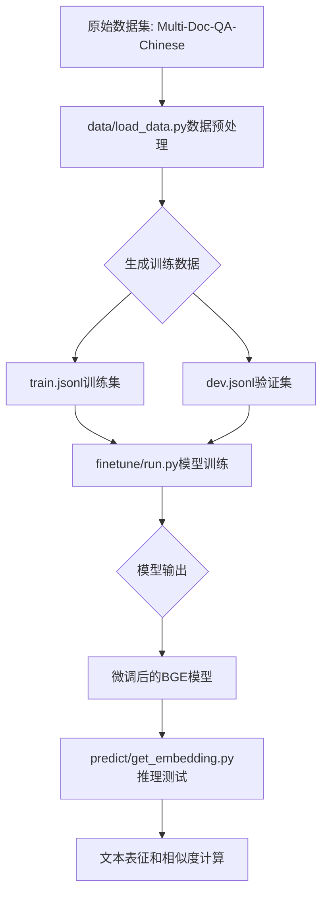

## 项目简介

本项目是基于BGE模型的文本表征模型。利用bge-base-zh模型从开源数据中进行长文本表征任务微调，并利用对比学习方法进行数据构造。

项目主要结构如下：
- data：存放数据及数据处理的文件夹。
  - dev.jsonl：验证集数据。
  - train.jsonl：训练数据。
  - load_data.py：用于针对开源数据进行数据处理，生成训练集及验证集数据。
- finetune：模型训练的文件夹。
  - arguments.py：BGE训练中相关的配置信息。
  - data.py：BGE训练时所需要构建的数据格式。
  - modeling.py：BGE模型文件。
  - run.py：BGE训练主函数。
  - trainer.py：BGE训练的trainer方法。
- predict：推理所需的代码文件夹。
  - get_embedding.py：利用已训练的模型进行文本表征并计算相似度

## 整体流程



## 数据处理

load_data.py文件，会在data文件夹中生成训练集和测试集文件。

命令如下：

```shell
cd data

python3 load_data.py --data_path "your_data_path" --save_home "./"
```

本项目中的数据来源于开源社区huggingface.co中的Multi-Doc-QA-Chinese，参考文档源数据来自悟道开源200GB数据，其中问题和回答是通过大语言模型（GPT-3.5）自动生成的，并且具有高质量。原始数据集中，每个样本包含一个参考文档、99个无关文档、一个问题和一个基于参考文档的回答。

数据地址为：https://huggingface.co/datasets/yuyijiong/Multi-Doc-QA-Chinese

注意：如果需要修改数据生成路径或名称，load_data.py中相关配置的路径。

数据处理流程：
1. 从原始数据中提取问题(query)、正样本(pos)和负样本(neg)
2. 将数据按比例分割为训练集(99%)和验证集(1%) 
3. 保存为[train.jsonl](bge-finetune/data/train.jsonl)和[dev.jsonl](bge-finetune/data/dev.jsonl)文件

数据处理关键代码片段：

```python
def get_data(home, save_home):
    """
    处理原始数据，生成训练和验证集
    """
    data = []
    for name in os.listdir(home):
        if not name.endswith('json'):
            continue
        path2 = os.path.join(home, name)
        print(path2)
        with open(path2, 'r', encoding="utf-8") as f:
            for line in f:
                sample = json.loads(line)
                query = sample['QA'][0]['question']
                pos = [sample['positive_doc'][0]['text']]
                negative_doc = sample['negative_doc']
                neg = [negative_doc[idx]['text'] for idx in random.choices(range(len(negative_doc)), k=10)]
                # 构造训练数据格式
                data.append(json.dumps({"query": query, "pos": pos, "neg": neg}, ensure_ascii=False))

    # 按比例分割训练集和验证集
    size = int(len(data) * 0.01)
    train = data[size:]
    dev = data[:size]
    
    # 保存数据
    with open(os.path.join(save_home, 'train.jsonl'), 'w', encoding="utf-8") as f:
        f.writelines('\n'.join(train))
    with open(os.path.join(save_home, 'dev.jsonl'), 'w', encoding="utf-8") as f:
        f.writelines('\n'.join(dev))
```

生成的数据格式如下：
```json
{
  "query": "孩子为什么容易在手术前感到紧张或焦虑？",
  "pos": ["即使是小手术,也会让人紧张不已。孩子们很容易在手术前感到紧张或焦虑,因为他们不太容易理解复杂的医学术语。此外,医生也不愿意向16岁以下的儿童开抗焦虑药物。"],
  "neg": ["一到周末就睡到中午?专家提醒赖床补觉只会适得其反\n\n经过了一个星期的工作和学习,你是不是一到周末就想睡到自然醒？", "..."]
}
```

## 模型微调

模型训练需要运行run.py文件，会自动生成output_dir文件夹，存放每个save_model_step保存的模型文件。

本项目中采用BGE模型进行微调，模型为huggiFace中的 BAAI/bge-base-zh，路径为：https://huggingface.co/BAAI/bge-base-zh

命令如下：
- 模型训练训练
```shell
cd finetune

python3 run.py --model_name_or_path "BAAI/bge-base-zh" \
               --train_data "../data/train.jsonl" \
               --output_dir ./save_files \
               --num_train_epochs 3 \
               --per_device_train_batch_size 4 \
               --learning_rate 1e-5 \
               --save_steps 1000 \
               --logging_steps 100 \
               --query_max_len 32 \
               --passage_max_len 128
```

训练流程说明：
1. 加载预训练的BGE模型和分词器
2. 构建训练数据集，使用[TrainDatasetForEmbedding](bge-finetune/finetune/data.py#L41-L121)类处理训练数据
3. 使用[BiEncoderModel](bge-finetune/finetune/modeling.py#L9-L153)双塔模型结构进行训练
4. 使用[BiTrainer](bge-finetune/finetune/trainer.py#L13-L138)进行模型训练和优化
5. 保存训练好的模型和分词器

也可以使用[bge_finetune.py](bge-finetune/bge_finetune.py)进行训练：
```shell
python3 bge_finetune.py --do_train \
                        --model_name "BAAI/bge-base-zh" \
                        --train_file "data/train.jsonl" \
                        --valid_file "data/dev.jsonl" \
                        --output_dir ./outputs/bge-model \
                        --num_epochs 3 \
                        --batch_size 4
```

### 训练参数配置

训练参数通过[arguments.py](bge-finetune/finetune/arguments.py)定义，主要包含三类参数：

1. 模型参数(ModelArguments)：
```python
@dataclass
class ModelArguments:
    model_name_or_path: str = field(
        metadata={"help": "Path to pretrained model or model identifier from huggingface.co/models"}
    )
    config_name: Optional[str] = field(
        default=None, metadata={"help": "Pretrained config name or path if not the same as model_name"}
    )
    tokenizer_name: Optional[str] = field(
        default=None, metadata={"help": "Pretrained tokenizer name or path if not the same as model_name"}
    )
```

2. 数据参数(DataArguments)：
```python
@dataclass
class DataArguments:
    train_data: str = field(
        default=None, metadata={"help": "Path to train data"}
    )
    train_group_size: int = field(default=8)
    query_max_len: int = field(
        default=32,
        metadata={
            "help": "The maximum total input sequence length after tokenization for passage. Sequences longer "
                    "than this will be truncated, sequences shorter will be padded."
        },
    )
    passage_max_len: int = field(
        default=128,
        metadata={
            "help": "The maximum total input sequence length after tokenization for passage. Sequences longer "
                    "than this will be truncated, sequences shorter will be padded."
        },
    )
```

3. 训练参数(RetrieverTrainingArguments)：
```python
@dataclass
class RetrieverTrainingArguments(TrainingArguments):
    negatives_cross_device: bool = field(default=False, metadata={"help": "share negatives across devices"})
    temperature: Optional[float] = field(default=0.02)
    fix_position_embedding: bool = field(default=False, metadata={"help": "Freeze the parameters of position embeddings"})
    sentence_pooling_method: str = field(default='cls', metadata={"help": "the pooling method, should be cls or mean"})
    normlized: bool = field(default=True)
    use_inbatch_neg: bool = field(default=True, metadata={"help": "Freeze the parameters of position embeddings"})
```

### 数据处理逻辑

训练数据通过[TrainDatasetForEmbedding](bge-finetune/finetune/data.py#L41-L121)类进行处理：

```python
class TrainDatasetForEmbedding(Dataset):
    def __getitem__(self, item) -> Tuple[str, List[str]]:
        query = self.dataset[item]['query']
        if self.args.query_instruction_for_retrieval is not None:
            query = self.args.query_instruction_for_retrieval + query

        passages = []
        pos = random.choice(self.dataset[item]['pos'])
        passages.append(pos)

        if len(self.dataset[item]['neg']) < self.args.train_group_size - 1:
            num = math.ceil((self.args.train_group_size - 1) / len(self.dataset[item]['neg']))
            negs = random.sample(self.dataset[item]['neg'] * num, self.args.train_group_size - 1)
        else:
            negs = random.sample(self.dataset[item]['neg'], self.args.train_group_size - 1)
        passages.extend(negs)

        if self.args.passage_instruction_for_retrieval is not None:
            passages = [self.args.passage_instruction_for_retrieval+p for p in passages]
        return query, passages
```

### 模型结构

模型使用[BiEncoderModel](bge-finetune/finetune/modeling.py#L9-L153)双塔结构，分别编码查询和段落：

```python
class BiEncoderModel(nn.Module):
    def __init__(self,
                 model_name: str = None,
                 normlized: bool = False,
                 sentence_pooling_method: str = 'cls',
                 negatives_cross_device: bool = False,
                 temperature: float = 1.0,
                 use_inbatch_neg: bool = True
                 ):
        super().__init__()
        self.model = AutoModel.from_pretrained(model_name)
        self.cross_entropy = nn.CrossEntropyLoss(reduction='mean')
        self.normlized = normlized
        self.sentence_pooling_method = sentence_pooling_method
        self.temperature = temperature
        self.use_inbatch_neg = use_inbatch_neg

    def sentence_embedding(self, hidden_state, mask):
        if self.sentence_pooling_method == 'mean':
            s = torch.sum(hidden_state * mask.unsqueeze(-1).float(), dim=1)
            d = mask.sum(axis=1, keepdim=True).float()
            return s / d
        elif self.sentence_pooling_method == 'cls':
            return hidden_state[:, 0]

    def encode(self, features):
        if features is None:
            return None
        psg_out = self.model(**features, return_dict=True)
        p_reps = self.sentence_embedding(psg_out.last_hidden_state, features['attention_mask'])
        if self.normlized:
            p_reps = torch.nn.functional.normalize(p_reps, dim=-1)
        return p_reps.contiguous()
```

## 模型推理

模型融合执行命令：
```shell
cd predict

python3 get_embedding.py --model_name_or_path "your_model_path"
```

推理流程说明：
1. 加载训练好的模型权重
2. 对输入文本进行编码，生成文本向量表示
3. 计算文本向量之间的相似度

使用示例：
```shell
python3 predict/get_embedding.py --model_name_or_path "./finetune/save_files"
```

或者使用[bge_finetune.py](bge-finetune/bge_finetune.py)进行推理：
```shell
python3 bge_finetune.py --do_predict \
                        --output_dir "./finetune/save_files" \
                        --test_file "data/dev.jsonl"
```

推理关键代码：

```python
def get_similarity(model_path):
    questions = ["孩子为什么容易在手术前感到紧张或焦虑？"]
    paragraph = ["即使是小手术,也会让人紧张不已。孩子们很容易在手术前感到紧张或焦虑,因为他们不太容易理解复杂的医学术语。此外,医生也不愿意向16岁以下的儿童开抗焦虑药物。", "一到周末就睡到中午?专家提醒赖床补觉只会适得其反\n\n经过了一个星期的工作和学习,你是不是一到周末就想睡到自然醒？"]
    
    model = FlagModel(model_path,
                      query_instruction_for_retrieval="为这个句子生成表示以用于检索相关文章：",
                      use_fp16=True)
    
    # 编码文本
    embeddings_1 = model.encode(questions)
    embeddings_2 = model.encode(paragraph)
    
    # 计算相似度
    similarity = embeddings_1 @ embeddings_2.T
    print(similarity)
```

推理过程主要包括：
1. 加载模型和分词器
2. 对查询和段落文本进行编码
3. 通过点积计算相似度得分

## 总结

本项目实现了基于BGE模型的中文文本表征任务微调，通过对比学习的方式优化模型在检索任务中的表现。项目包含完整的数据预处理、模型训练和推理流程，可以用于构建高效的文本检索系统。

核心特点：
1. 使用对比学习方法进行训练，提高文本表征质量
2. 支持跨设备负样本共享，增强训练效果
3. 提供完整的训练和推理流程
4. 支持模型参数的灵活配置