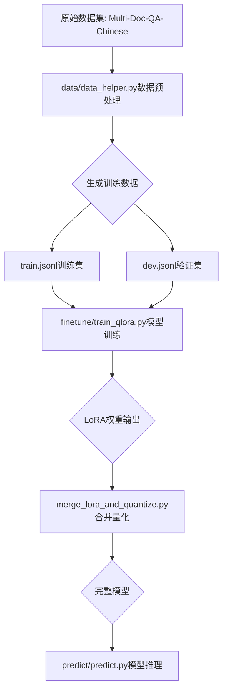

## 项目简介

项目是基于ChatGLM-3知识库答案生成任务的微调方法介绍。利用ChatGLM-3-6B模型从开源数据中进行长文本表征任务微调，并利用对比学习方法进行数据构造。

项目主要结构如下：
- data：存放数据及数据处理的文件夹。
  - dev.jsonl：验证集数据。
  - train.jsonl：训练数据。
  - data_helper.py：用于针对开源数据进行数据处理，生成训练集及验证集数据。
- finetune：模型训练的文件夹。
  - train_qlora.py：使用QLoRA进行ChatGLM3训练的函数。
  - merge_lora_and_quantize.py：合并LoRA权重和量化模型的函数。
- predict：推理所需的代码文件夹。
  - predict.py：利用已训练的模型进行模型生成的方法。

## 整体流程



## 数据处理

数据预处理需要运行[data_helper.py](chatglm3-finetune/data/data_helper.py)文件，会在data文件夹中生成训练集和测试集文件。

命令如下：

```shell
cd data

python3 data_helper.py --data_path "./multi" \
                       --save_home "./"
```

本项目中的数据来源于开源社区huggingface.co中的Multi-Doc-QA-Chinese，参考文档源数据来自悟道开源200GB数据，其中问题和回答是通过大语言模型（GPT-3.5）自动生成的，并且具有高质量。原始数据集中，每个样本包含一个参考文档、99个无关文档、一个问题和一个基于参考文档的回答。

数据地址为：https://huggingface.co/datasets/yuyijiong/Multi-Doc-QA-Chinese

注意：如果需要修改数据生成路径或名称，请修改[data_helper.py](chatglm3-finetune/data/data_helper.py)中相关配置的路径。

数据处理流程说明：
1. 从原始Multi-Doc-QA-Chinese数据集中提取问题、答案和相关文档
2. 构造指令微调格式(instruction tuning format)的数据
3. 按比例分割为训练集(99%)和验证集(1%)

数据处理关键代码片段：

```python
def get_data(home, save_home):
    """
    数据处理
    :param home: 开源数据集路径
    :param save_home: 保存数据集路径
    :return:
    """
    data = []
    for name in os.listdir(home):
        if not name.endswith('json'):
            continue
        path2 = os.path.join(home, name)
        print(path2)
        with open(path2, 'r', encoding="utf-8") as f:
            for line in f:
                sample = json.loads(line)
                query = sample['QA'][0]['question']
                answer = sample['QA'][0]['answer']
                doc = sample['positive_doc'][0]['text']
                # 构造指令微调格式
                one = {
                    "instruction": f"你现在是一个可以根据文档内容进行问答的机器人，以下是用于参考的文档内容：\n\n{doc}\n问题为：{query}\n答：",
                    "output": answer
                }
                data.append(json.dumps(one, ensure_ascii=False))

    # 分割训练集和验证集
    size = int(len(data) * 0.01)
    train = data[size:]
    dev = data[:size]
    
    # 保存数据
    with open(os.path.join(save_home, 'train.jsonl'), 'w', encoding="utf-8") as f:
        f.writelines('\n'.join(train))
    with open(os.path.join(save_home, 'dev.jsonl'), 'w', encoding="utf-8") as f:
        f.writelines('\n'.join(dev))
```

生成的数据格式如下：
```json
{
  "instruction": "你现在是一个可以根据文档内容进行问答的机器人，以下是用于参考的文档内容：\n\n{文档内容}\n问题为：{问题}\n答：",
  "output": "{答案}"
}
```

## 模型微调

模型训练需要运行[train_qlora.py](chatglm3-finetune/finetune/train_qlora.py)文件，会自动生成output_dir文件夹，存放每个save_model_step保存的模型文件。

命令如下：
- 模型训练训练
```shell
cd finetune
python3 train_qlora.py --train_args_json ./chatglm3-6b_QLoRA.json  \
                            --train_data_path ../data/train.jsonl  \
                            --eval_data_path ../data/dev.jsonl  \
                            --model_name_or_path chatglm3-6b/  \
                            --seed 42  \
                            --max_input_length 1024  \
                            --max_output_length 512  \
                            --lora_rank 4  \
                            --lora_dim 8
```

训练配置参数保存在[chatglm3-6b_QLoRA.json](chatglm3-finetune/finetune/chatglm3-6b_QLoRA.json)文件中：

```json
{
  "output_dir": "saved_files/chatglm3-6b_QLoRA",
  "per_device_train_batch_size": 4,
  "gradient_accumulation_steps": 8,
  "per_device_eval_batch_size": 4,
  "learning_rate": 1e-3,
  "num_train_epochs": 1.0,
  "lr_scheduler_type": "linear",
  "warmup_ratio": 0.1,
  "logging_steps": 5,
  "save_strategy": "steps",
  "save_steps": 500,
  "evaluation_strategy": "steps",
  "eval_steps": 500,
  "optim": "adamw_torch",
  "fp16": false,
  "remove_unused_columns": false,
  "ddp_find_unused_parameters": false,
  "seed": 42
}
```

### QLoRA训练实现

训练使用QLoRA技术，通过4bit量化和LoRA适配器来减少显存占用并加速训练。

关键训练代码：

```python
# 配置量化参数
q_config = BitsAndBytesConfig(load_in_4bit=True,
                              bnb_4bit_quant_type='nf4',
                              bnb_4bit_use_double_quant=True,
                              bnb_4bit_compute_dtype=_compute_dtype_map[global_args.compute_dtype])

# 加载模型
model = AutoModel.from_pretrained(global_args.model_name_or_path,
                                  quantization_config=q_config,
                                  device_map='auto',
                                  trust_remote_code=True)

model = prepare_model_for_kbit_training(model, use_gradient_checkpointing=True)

# 配置LoRA
target_modules = TRANSFORMERS_MODELS_TO_LORA_TARGET_MODULES_MAPPING['chatglm']
lora_config = LoraConfig(
    r=global_args.lora_rank,
    lora_alpha=global_args.lora_alpha,
    target_modules=target_modules,
    lora_dropout=global_args.lora_dropout,
    bias='none',
    inference_mode=False,
    task_type=TaskType.CAUSAL_LM
)
model = get_peft_model(model, lora_config)
```

### 数据处理

训练数据通过tokenize_func函数处理，并使用DataCollatorForChatGLM进行批处理：

```python
def tokenize_func(example, tokenizer, global_args, ignore_label_id=-100):
    """单样本tokenize处理"""
    question = global_args.prompt_text + example['instruction']
    if example.get('input', None):
        if example['input'].strip():
            question += f'''\n{example['input']}'''
    answer = example['output']
    q_ids = tokenizer.encode(text=question, add_special_tokens=False)
    a_ids = tokenizer.encode(text=answer, add_special_tokens=False)
    if len(q_ids) > global_args.max_input_length - 2:  # 2 - gmask, bos
        q_ids = q_ids[: global_args.max_input_length - 2]
    if len(a_ids) > global_args.max_output_length - 1:  # 1 - eos
        a_ids = a_ids[: global_args.max_output_length - 1]
    input_ids = tokenizer.build_inputs_with_special_tokens(q_ids, a_ids)
    question_length = len(q_ids) + 2  # chatglm1 - gmask, bos, chatglm2 - gmask, sop
    labels = [ignore_label_id] * question_length + input_ids[question_length:]
    return {'input_ids': input_ids, 'labels': labels}

class DataCollatorForChatGLM:
    def __init__(self,
                 pad_token_id: int,
                 max_length: int = 2048,
                 ignore_label_id: int = -100):
        self.pad_token_id = pad_token_id
        self.ignore_label_id = ignore_label_id
        self.max_length = max_length

    def __call__(self, batch_data: List[Dict[str, List]]) -> Dict[str, torch.Tensor]:
        """根据batch最大长度做padding"""
        len_list = [len(d['input_ids']) for d in batch_data]
        batch_max_len = max(len_list)
        input_ids, labels = [], []
        for len_of_d, d in sorted(zip(len_list, batch_data), key=lambda x: -x[0]):
            pad_len = batch_max_len - len_of_d
            ids = d['input_ids'] + [self.pad_token_id] * pad_len
            label = d['labels'] + [self.ignore_label_id] * pad_len
            if batch_max_len > self.max_length:
                ids = ids[: self.max_length]
                label = label[: self.max_length]
            input_ids.append(torch.LongTensor(ids))
            labels.append(torch.LongTensor(label))
        input_ids = torch.stack(input_ids)
        labels = torch.stack(labels)
        return {'input_ids': input_ids, 'labels': labels}
```

## 模型合并与量化

训练完成后，可以使用[merge_lora_and_quantize.py](chatglm3-finetune/finetune/merge_lora_and_quantize.py)脚本将LoRA权重与基础模型合并，并可选择进行量化：

```shell
python3 merge_lora_and_quantize.py --lora_path "your_lora_path" \
                                   --output_path "merged_model_path" \
                                   --qbits 4
```

合并关键代码：

```python
def merge_lora(lora_path, device_map=None):
    """合并lora模型和base模型"""
    if device_map is None:
        device_map = {'': 'cpu'}
    config = PeftConfig.from_pretrained(lora_path)
    base_model = AutoModel.from_pretrained(config.base_model_name_or_path,
                                           load_in_8bit=False,
                                           trust_remote_code=True, torch_dtype=torch.float32,
                                           device_map=device_map)
    model = PeftModel.from_pretrained(base_model, lora_path, device_map=device_map)
    model = model.merge_and_unload()
    return model, config

def quantize(model, qbits=4):
    """量化模型，qbit为4或8"""
    qmodel = model.quantize(qbits).half().cuda()
    qmodel = qmodel.eval()
    return qmodel
```

## 模型推理

模型融合执行命令：
```shell
cd predict
python3 predict.py --model_path "your_model_path"
```

推理关键代码：

```python
def get_result(model_path, question):
    """
    使用模型进行推理
    :param model_path:  模型路径
    :param question: 问题
    :return:
    """
    tokenizer = AutoTokenizer.from_pretrained(model_path, trust_remote_code=True)
    model = AutoModel.from_pretrained(model_path, trust_remote_code=True).half().cuda()
    model = model.eval()
    input_ = question
    response, history = model.chat(tokenizer, input_, history=[])
    print(response)
```

推理时使用ChatGLM3的chat接口进行对话生成，支持历史对话上下文。

## 总结

项目核心特点：
1. 使用QLoRA技术进行高效微调，显著降低显存占用
2. 支持4bit量化和LoRA适配器结合，进一步减少资源消耗
3. 完整的训练、合并、量化和推理流程
4. 针对RAG问答任务的数据处理和指令微调格式