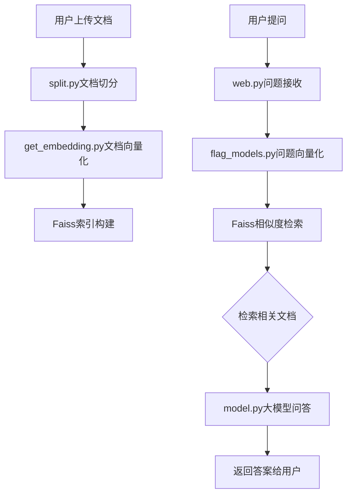

基于Streamlit的知识库答案应用搭建。

## 项目简介

项目主要结构如下：
- faiss_module：Faiss向量检索模块。
  - get_embedding.py：文档向量化和Faiss索引构建。
- web_service：Streamlit综合服务。
  - web.py：Streamlit问答主函数。
  - split.py：用于针对输入文档进行拆分的方法。
  - model.py：大语言模型调用接口。
  - flag_models.py：文本向量化模型实现。
  - configs.py：配置文件。

## 整体流程



## 文档处理流程

文档处理首先通过[split.py](service/web_service/split.py)对用户上传的文档进行切分，支持PDF和DOCX格式：

```python
def split_content_to_parse(content, max_length):
    """
    将内容按句子分割并重新组合成段落
    """
    sentences = re.split(r"([。！？；.!?;])", content)
    sentences.append("")
    sentences = ["".join(i) for i in zip(sentences[0::2], sentences[1::2])]
    if sentences[-1] == "":
        sentences.pop(-1)
    all_paras = []
    all_sentences_num_in_paras = []
    paras = []
    sentences_num_in_paras = 0
    sentences_num = len(sentences)
    for idx, sen in enumerate(sentences):
        if len("".join(paras)) <= max_length:
            paras.append(sen)
            sentences_num_in_paras += 1
        if len("".join(paras)) > max_length:
            if sentences_num_in_paras > 1:
                all_paras.append("".join(paras[:-1]))
                all_sentences_num_in_paras.append(sentences_num_in_paras - 1)
                paras = []
                sentences_num_in_paras = 1
                paras.append(sen)
            else:
                all_paras.append("".join(paras))
                all_sentences_num_in_paras.append(sentences_num_in_paras)
                paras = []
                sentences_num_in_paras = 0
        if idx == sentences_num - 1 and sentences_num_in_paras >= 1:
            all_paras.append("".join(paras))
            all_sentences_num_in_paras.append(sentences_num_in_paras)
    return all_paras, all_sentences_num_in_paras
```

文档加载服务：

```python
class LoadFileService:
    def __init__(self, max_para_length=512):
        self.max_para_length = max_para_length

    def load_files(self, file_path):
        para = []
        if file_path.endswith("pdf"):
            para = self._get_pdf_lines(file_path)
        elif file_path.endswith("docx"):
            para = self._get_doc_lines(file_path)
        return para

    def _get_pdf_lines(self, pdf_path):
        reader = PdfReader(pdf_path)
        number_of_pages = len(reader.pages)
        all_paras = []
        print("Start loading pdf")
        result = []
        for i in tqdm(range(number_of_pages)):
            page = reader.pages[i]
            all_lines = page.extract_text()
            paras, _ = split_content_to_parse(all_lines, self.max_para_length)
            all_paras += paras
        return all_paras

    def _get_doc_lines(self, doc_path):
        doc = Document(doc_path)
        all_paras = []
        print("Start loading doc")
        for paragraph in tqdm(doc.paragraphs):
            paras, _ = split_content_to_parse(paragraph.text, self.max_para_length)
            all_paras += paras
        return all_paras
```

## 向量检索模块

使用[get_embedding.py](service/faiss_module/get_embedding.py)构建文档向量索引和检索相关文档：

```python
class Service:
    def __init__(self, model_path, doc_path):
        self.model = FlagModel(model_path,
                               query_instruction_for_retrieval="为这个句子生成表示以用于检索相关文章：",
                               use_fp16=True)
        self.faiss_index, self.all_lines = self.load_doc(doc_path)

    def predict_vector(self, text):
        vector = self.model.encode(text)
        return vector

    def load_doc(self, doc_path):
        """
        加载doc相关文档，本次直接采用拆解完毕的jsonl 文件来运行，请注意您文档的格式
        :param doc_path: jsonl 文件目录
        :return:
        """
        all_lines = []
        all_vectors = []
        with open(doc_path, 'r', encoding="utf-8") as f:
            for line in tqdm(f.readlines()):
                sample = json.loads(line)
                text = sample["text"]
                vector = self.predict_vector(text)
                all_lines.append(text)
                all_vectors.append(vector)
        vectors = np.array(all_vectors)
        faiss_index = faiss.IndexFlatIP(vectors.shape[1])
        faiss_index.add(vectors)
        return faiss_index, all_lines

    def find_topk_text(self, faiss_index, text, topk):
        this_vector = self.predict_vector(text)
        source_vecs = normalize(this_vector, axis=1)
        res_distance, res_index = faiss_index.search(source_vecs, topk)
        lines = []
        for i, idx in enumerate(res_index):
            score = res_distance[i]
            text = self.all_lines[idx]
            lines.append(text)
        return lines
```

## Web服务模块

[web.py](service/web_service/web.py)是主要的Streamlit应用入口，整合了文档处理、向量检索和大模型问答功能：

```python
class EmbeddingService:
    def __init__(self, args):
        self.embed_model_path = args.embed_model_path
        self.embed_model = self.load_embedding_model(self.embed_model_path)

    def load_embedding_model(self, model_path):
        embed_model = FlagModel(model_path,
                                query_instruction_for_retrieval="为这个句子生成表示以用于检索相关文章：",
                                use_fp16=True)
        return embed_model

    def get_embedding(self, doc_info):
        doc_vectors = self.embed_model.encode(doc_info)
        doc_vectors = np.stack(doc_vectors).astype('float32')
        dimension = 512
        index = faiss.IndexFlatL2(dimension)
        index.add(doc_vectors)
        return index

    def search_doc(self, query, doc_info, index: faiss.IndexFlatL2, k: int):
        query_vector = self.embed_model.encode([query])
        query_vector = np.array(query_vector).astype('float32')
        distances, indexes = index.search(query_vector, k)
        found_docs = []
        for i, (distance, index) in enumerate(zip(distances[0], indexes[0])):
            print(f"Result {i + 1}, Distance: {distance}")
            found_docs.append(doc_info[i])
        return found_docs

class GLMService:
    def __init__(self, args):
        self.args = args
        self.glm_model, self.tokenizer = self.init_model(self.args.model_path)

    def init_model(self, model_path):
        tokenizer = AutoTokenizer.from_pretrained(model_path, trust_remote_code=True)
        model = AutoModel.from_pretrained(model_path, trust_remote_code=True).half().cuda()
        model = model.eval()
        return model, tokenizer

    def get_result(self, doc, question):
        input_ = f"你现在是一个可以根据文档内容进行问答的机器人，以下是用于参考的文档内容：\n\n{doc}\n问题为：{question}\n答："
        response, history = self.glm_model.chat(self.tokenizer, input_, history=[])
        return response
```

## 服务运行

模型训练需要运行[web.py](service/web_service/web.py)文件进行streamlit加载：

命令如下：
```shell
cd service/web_service

streamlit run web.py -- --server.port 1111 \
                      -- --embed_model_path 'your embedding model path' \
                      -- --model_path 'your llm model path'
```

运行流程说明：
1. 初始化ChatGLM大语言模型和BGE向量模型
2. 启动Streamlit Web服务
3. 用户上传文档文件（PDF或DOCX格式）
4. 系统自动切分文档并构建向量索引
5. 用户输入问题，系统检索相关文档片段
6. 将问题和相关文档发送给大语言模型生成答案

关键实现代码：

```python
def main():
    # 初始化ChatGLM3-6模型
    st.session_state.glm_service = GLMService(args)
    print("llm is loaded")

    # 初始化BGE向量模型
    st.session_state.embedding_service = EmbeddingService(args)
    print("embedding_service is loaded")

    lines = ["1", "2", "3"]
    st.session_state.embedding_service.get_embedding(lines)
    st.markdown("初始化完成，请上传文件")
    # 获取知识库文件
    uploaded_file = st.file_uploader("请上传文件")
    temp_file = NamedTemporaryFile(delete=False, suffix=os.path.splitext(uploaded_file.name)[1])
    temp_file.write(uploaded_file.getvalue())
    # 构造包含扩展名的临时文件路径
    file_path = temp_file.name
    with st.spinner('Reading file...'):
        texts = load_file(file_path)
    st.success('Finished reading file.')
    temp_file.close()

    # 初始化文档，对文档内容进行向量化
    st.session_state.index = st.session_state.embedding_service.get_embedding(texts)

    # 获取用户问题
    st.markdown("#### 请在下列文框中输入您的问题：")
    if 'generated' not in st.session_state:
        st.session_state['generated'] = []
    if 'past' not in st.session_state:
        st.session_state['past'] = []
    user_input = st.text_input("请输入您的问题:", key='input')

    if user_input:
        # 获取用户问题，并得到向量表征，利用已加载的Faiss获取K个相关doc
        found_docs = st.session_state.embedding_service.search_doc(user_input, texts, st.session_state.index, k=3)
        st.markdown("#### 检索到以下内容：")
        for one in found_docs:
            st.markdown(f"{one}")

        found_doc = "\n".join(found_docs)

        # 生成答案并返回结果展示
        output = st.session_state.glm_service.get_result(found_doc, user_input)
        st.session_state['past'].append(user_input)
        st.session_state['generated'].append(output)
    if st.session_state['generated']:
        for i in range(len(st.session_state['generated']) - 1, -1, -1):
            message(st.session_state["generated"][i], key=str(i))
            message(st.session_state['past'][i],
                    is_user=True, key=str(i) + '_user')
            st.button("清空对话", on_click=clear_chat_history)
```

## 总结

本项目基于RAG（Retrieval-Augmented Generation）技术构建了一个完整的问答系统，包含文档处理、向量检索和大语言模型问答三个核心模块。通过Streamlit构建了友好的Web界面，用户可以方便地上传文档并进行问答交互。