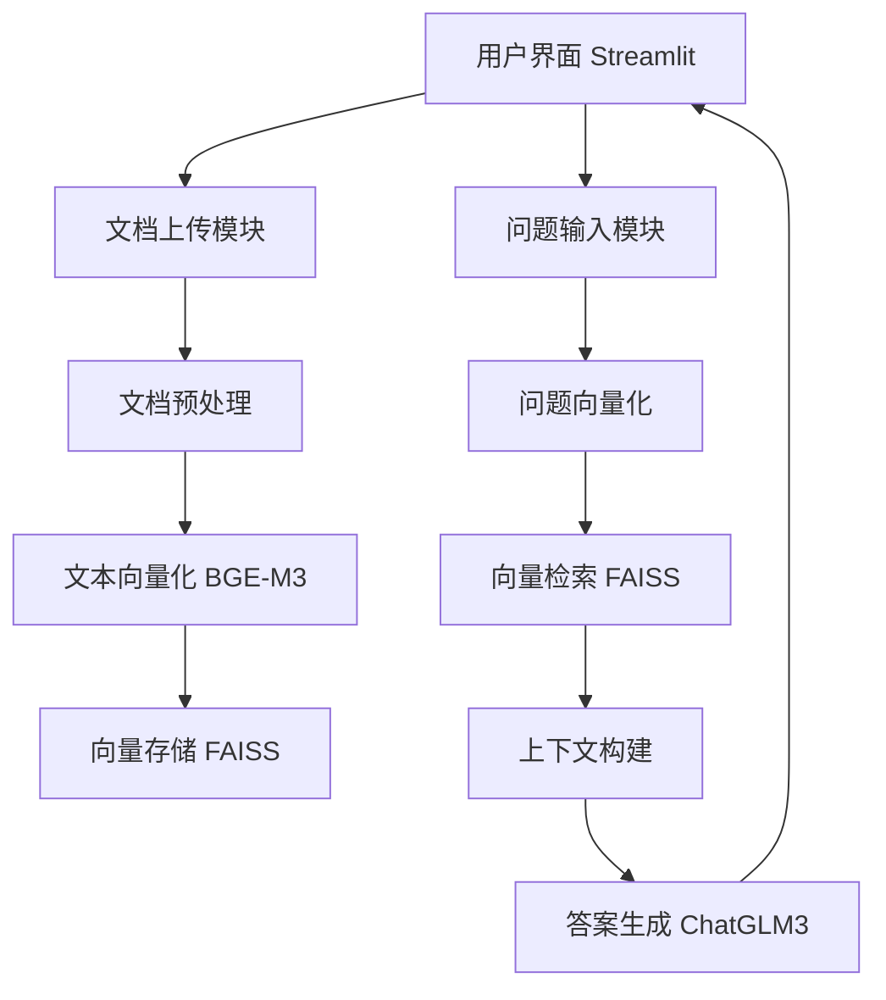

# RAG应用技术方案设计：基于Streamlit + BGE-M3 + ChatGLM3 + FAISS

## 一、整体架构设计



## 二、模块详细设计

### 1. 环境准备
```bash
# 安装核心依赖
pip install streamlit modelscope faiss-cpu transformers langchain pymupdf sentence-transformers
```

### 2. 文件结构
```
rag-app/
├── app.py                  # Streamlit主应用
├── vector_db.py            # FAISS向量数据库管理
├── embedding_utils.py      # 向量化工具
├── document_loader.py      # 文档加载与处理
├── rag_engine.py           # RAG问答引擎
├── data/                   # 上传文档存储
├── vector_store/           # FAISS索引存储
└── requirements.txt
```

### 3. 核心模块实现

#### 3.1 文档加载与处理 (`document_loader.py`)
```python
import fitz  # PyMuPDF
import os

def load_pdf(file_path):
    """加载PDF文档并提取文本"""
    text = ""
    try:
        doc = fitz.open(file_path)
        for page in doc:
            text += page.get_text()
    except Exception as e:
        print(f"Error loading PDF: {e}")
    return text

def load_txt(file_path):
    """加载TXT文档"""
    try:
        with open(file_path, 'r', encoding='utf-8') as f:
            return f.read()
    except Exception as e:
        print(f"Error loading TXT: {e}")
        return ""

def chunk_text(text, chunk_size=512, overlap=50):
    """文本分块处理"""
    chunks = []
    start = 0
    while start < len(text):
        end = min(start + chunk_size, len(text))
        chunks.append(text[start:end])
        start = end - overlap
    return chunks
```

#### 3.2 向量化工具 (`embedding_utils.py`)
```python
from modelscope.models import Model
from modelscope.pipelines import pipeline
from modelscope.utils.constant import Tasks

class BGEM3Embedder:
    def __init__(self):
        self.model_id = "BAAI/bge-m3"
        self.model = Model.from_pretrained(self.model_id)
        self.pipeline = pipeline(
            task=Tasks.feature_extraction,
            model=self.model,
            sequence_length=512
        )
    
    def embed_texts(self, texts):
        """向量化文本列表"""
        inputs = {"source_sentence": texts}
        results = self.pipeline(inputs)
        return results["text_embedding"]
    
    def embed_query(self, query):
        """向量化查询"""
        return self.embed_texts([query])[0]
```

#### 3.3 FAISS向量数据库管理 (`vector_db.py`)
```python
import faiss
import numpy as np
import os
import pickle

class FaissVectorDB:
    def __init__(self, index_path="vector_store/faiss_index.bin", metadata_path="vector_store/metadata.pkl"):
        self.index_path = index_path
        self.metadata_path = metadata_path
        self.index = None
        self.metadata = []
        
        # 加载现有索引或创建新索引
        if os.path.exists(index_path) and os.path.exists(metadata_path):
            self.load_index()
        else:
            self.create_index()
    
    def create_index(self, dim=1024):
        """创建新的FAISS索引"""
        self.index = faiss.IndexFlatIP(dim)  # 使用内积相似度
        os.makedirs(os.path.dirname(self.index_path), exist_ok=True)
    
    def load_index(self):
        """加载现有索引"""
        self.index = faiss.read_index(self.index_path)
        with open(self.metadata_path, "rb") as f:
            self.metadata = pickle.load(f)
    
    def save_index(self):
        """保存索引到文件"""
        faiss.write_index(self.index, self.index_path)
        with open(self.metadata_path, "wb") as f:
            pickle.dump(self.metadata, f)
    
    def add_documents(self, vectors, documents, metadatas):
        """添加文档向量到索引"""
        vectors = np.array(vectors).astype('float32')
        self.index.add(vectors)
        
        # 更新元数据
        start_idx = len(self.metadata)
        for i, (doc, meta) in enumerate(zip(documents, metadatas)):
            self.metadata.append({
                "id": start_idx + i,
                "document": doc,
                "metadata": meta
            })
        self.save_index()
    
    def search(self, query_vector, k=5):
        """相似性搜索"""
        query_vector = np.array([query_vector]).astype('float32')
        distances, indices = self.index.search(query_vector, k)
        
        # 获取相关文档和元数据
        results = []
        for idx, dist in zip(indices[0], distances[0]):
            if idx >= 0 and idx < len(self.metadata):
                results.append({
                    **self.metadata[idx],
                    "score": float(dist)
                })
        return results
```

#### 3.4 RAG问答引擎 (`rag_engine.py`)
```python
from transformers import AutoModel, AutoTokenizer

class ChatGLM3RAG:
    def __init__(self, model_name="THUDM/chatglm3-6b"):
        self.tokenizer = AutoTokenizer.from_pretrained(
            model_name, trust_remote_code=True
        )
        self.model = AutoModel.from_pretrained(
            model_name, trust_remote_code=True
        ).half().cuda().eval()  # 使用GPU加速
    
    def generate_response(self, query, context_docs):
        """基于检索内容生成回答"""
        # 构建提示
        context = "\n\n".join([doc['document'] for doc in context_docs])
        prompt = f"基于以下信息回答问题:\n\n{context}\n\n问题: {query}\n回答:"
        
        # 生成回答
        response, _ = self.model.chat(
            self.tokenizer,
            prompt,
            history=[],
            temperature=0.7,
            max_length=2048
        )
        
        # 添加引用信息
        references = [{"text": doc['document'], "source": doc['metadata']['source']} 
                      for doc in context_docs]
        return response, references
```

#### 3.5 Streamlit主应用 (`app.py`)
```python
import streamlit as st
import os
import time
from document_loader import load_pdf, load_txt, chunk_text
from embedding_utils import BGEM3Embedder
from vector_db import FaissVectorDB
from rag_engine import ChatGLM3RAG

# 初始化组件
@st.cache_resource
def init_components():
    embedder = BGEM3Embedder()
    vector_db = FaissVectorDB()
    rag_engine = ChatGLM3RAG()
    return embedder, vector_db, rag_engine

# 主应用
def main():
    st.title("智能文档问答系统 (RAG)")
    st.markdown("上传文档后，即可基于文档内容进行问答")
    
    # 初始化组件
    embedder, vector_db, rag_engine = init_components()
    
    # 文档上传与处理
    with st.sidebar:
        st.header("文档管理")
        uploaded_files = st.file_uploader(
            "上传PDF或TXT文档",
            type=["pdf", "txt"],
            accept_multiple_files=True
        )
        
        if st.button("处理文档"):
            if uploaded_files:
                with st.spinner("处理文档中..."):
                    for file in uploaded_files:
                        # 保存文件
                        file_path = f"data/{file.name}"
                        with open(file_path, "wb") as f:
                            f.write(file.getbuffer())
                        
                        # 加载文档内容
                        if file.name.endswith(".pdf"):
                            text = load_pdf(file_path)
                        else:
                            text = load_txt(file_path)
                        
                        # 分块处理
                        chunks = chunk_text(text)
                        
                        # 生成向量
                        vectors = embedder.embed_texts(chunks)
                        
                        # 添加到向量数据库
                        metadatas = [{"source": file.name}] * len(chunks)
                        vector_db.add_documents(vectors, chunks, metadatas)
                
                st.success(f"成功处理 {len(uploaded_files)} 个文档!")
            else:
                st.warning("请先上传文档")
    
    # 问答界面
    st.header("文档问答")
    query = st.text_input("输入您的问题:")
    
    if st.button("提问") and query:
        with st.spinner("思考中..."):
            # 向量化问题
            query_vector = embedder.embed_query(query)
            
            # 检索相关文档
            context_docs = vector_db.search(query_vector, k=3)
            
            # 生成回答
            response, references = rag_engine.generate_response(query, context_docs)
            
            # 显示结果
            st.subheader("回答:")
            st.write(response)
            
            # 显示引用
            st.subheader("参考来源:")
            for ref in references:
                with st.expander(f"文档: {ref['source']} (相关度: {ref.get('score', 0):.2f})"):
                    st.write(ref['text'])

if __name__ == "__main__":
    main()
```

## 三、部署与运行

### 1. 安装依赖
```bash
# 进入simple-web-service目录
cd simple-web-service

# 安装依赖
pip install -r requirements.txt
```

### 2. 运行应用
```bash
# 启动Streamlit应用
streamlit run app.py
```

默认情况下，应用将在 `http://localhost:8501` 上运行。

### 3. 使用说明
1. 在左侧边栏上传PDF或TXT格式的文档
2. 点击"处理文档"按钮，系统将自动处理上传的文档
3. 在主界面输入问题
4. 点击"提问"按钮获取基于文档内容的回答

## 四、部署与优化方案

### 1. 部署方式
```bash
# 本地运行
streamlit run app.py

# 生产部署 (使用Nginx + Gunicorn)
gunicorn -b 0.0.0.0:8501 -w 4 app:app
```

### 2. 性能优化措施

1. **向量索引优化**：
   - 使用IVFFlat或HNSW索引替代Flat索引
   - 启用GPU加速FAISS (`faiss-gpu`包)

2. **模型量化**：
   ```python
   # ChatGLM3模型量化加载
   model = AutoModel.from_pretrained(model_name, trust_remote_code=True).quantize(4).cuda()
   ```

3. **缓存机制**：
   - 使用`st.cache_data`缓存文档处理结果
   - 实现向量增量更新，避免重复处理

4. **异步处理**：
   - 使用`asyncio`实现文档上传的异步处理
   - 分离问答和文档处理线程

### 3. 扩展功能设计

1. **多文档管理**：
   - 实现文档删除/更新功能
   - 添加文档命名空间支持

2. **历史对话**：
   ```python
   # 在session_state中保存对话历史
   if 'history' not in st.session_state:
       st.session_state.history = []
   ```

3. **混合检索**：
   ```python
   # 在BGEM3Embedder中实现稠密+稀疏+多向量混合检索
   def hybrid_search(self, query):
       dense_vec = self.embed_query(query)
       sparse_vec = self.get_sparse_rep(query)
       # 组合两种表示进行检索
   ```

4. **答案评估**：
   - 添加用户反馈机制（👍/👎）
   - 实现答案质量自动评估

## 五、安全与监控

1. **安全措施**：
   - 文件上传类型验证
   - 内容安全过滤（敏感词检测）
   - API访问限制

2. **监控指标**：
   - 响应时间（检索+生成）
   - 检索召回率
   - 用户满意度评分

3. **日志系统**：
   ```python
   import logging
   logging.basicConfig(filename='app.log', level=logging.INFO)
   ```

## 六、技术方案优势

1. **中文优化**：
   - 使用BGE-M3模型专为中文优化
   - ChatGLM3对中文理解能力强

2. **高效检索**：
   - FAISS支持十亿级向量检索
   - 毫秒级响应时间

3. **易用性**：
   - Streamlit提供简洁UI
   - 开箱即用的部署方案

4. **可扩展性**：
   - 模块化设计易于扩展
   - 支持多文档类型和大规模数据

本方案提供了完整的RAG应用实现框架，结合了当前中文场景下最优的文本嵌入模型（BGE-M3）和大语言模型（ChatGLM3），通过FAISS实现高效检索，使用Streamlit构建直观的用户界面，可快速部署应用于企业知识库、智能客服等场景。


```shell
/opt/anaconda3/envs/bgechatglm3env/lib/python3.11/site-packages/huggingface_hub/file_download.py:945: FutureWarning: `resume_download` is deprecated and will be removed in version 1.0.0. Downloads always resume when possible. If you want to force a new download, use `force_download=True`.
  warnings.warn(
Setting eos_token is not supported, use the default one.
Setting pad_token is not supported, use the default one.
Setting unk_token is not supported, use the default one.
Downloading shards:   0%|                                                                                                                                       | 0/7 [00:00<?, ?it/s]
model-00001-of-00007.safetensors:   5%|████▉                                                                                                      | 83.9M/1.83G [00:20<57:18, 507kB/s]
```

